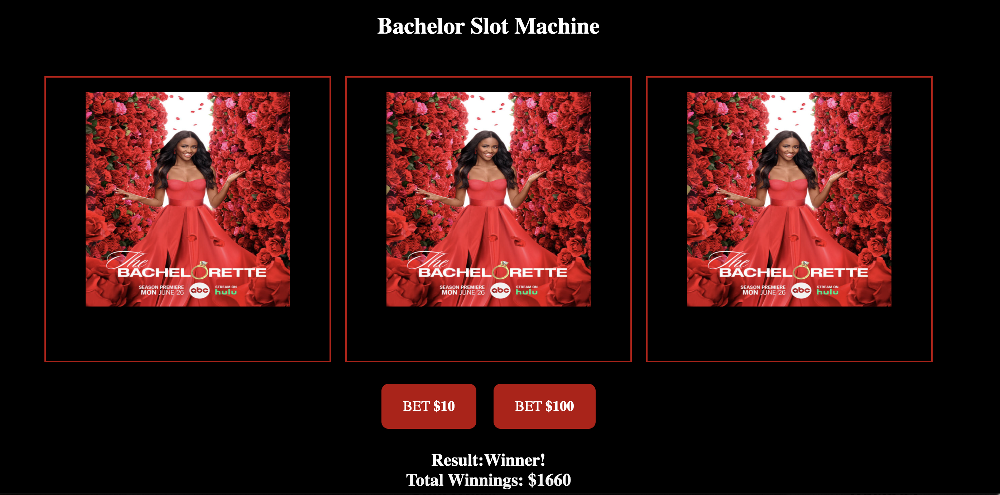
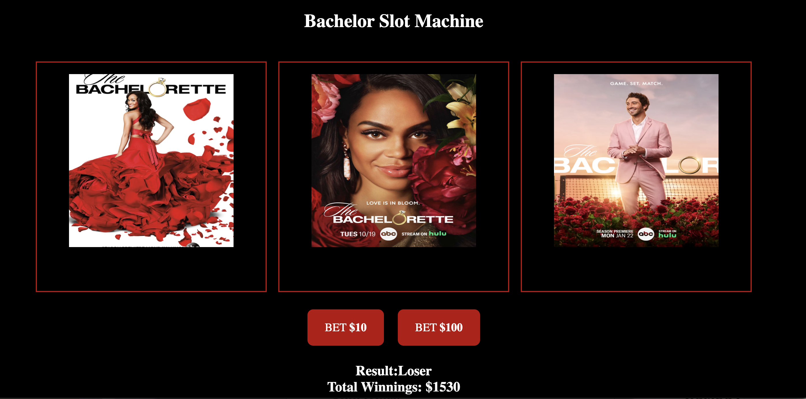

# Bachelor Slot Machine 

This application simulates a classic slot machine game where users can place bets, spin the reels, and watch their total balance update based on the results.

**Project Link:**  

## Features

- **Reel Setup:** The slot machine includes three reels, each containing a minimum of five distinct items.
- **Betting System:** Users can place a bet at either a minimum or maximum amount. 
- **Dynamic Total Update:** After spinning the reels, the user's total adjusts based on their bet and the results of the spin.

## Technologies Used

- HTML
- CSS
- JavaScript

## Screenshots

